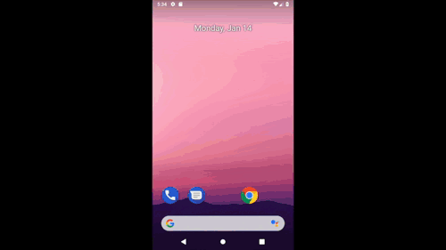

# Appium examples

All of the following examples perform basic interaction with the Google Maps application in android devices using the Appium server along other libraries such as TestNG, Spock and Extent Reports.

## About the examples:
	
Every inner folder contains a gradle project with a specific configuration, find below a brief description for each of them:

- [Basic](appium-java): A simple example with google maps using TestNG and Extent Reports.
- [Basic with Spock framework](appium-spock): Another simple example using Groovy and the Spock framework with BDD capabilities.
- [Spock, Data Pipes, and Reports](appium-spock-with-reports): A more sophisticated example with Data Pipes and custom reporting provided by the 		spock-utils library.

## General setup:

Appart from specific project requierments, the following steps are required for running all of the examples:

### 1: Java and Android

Donwload and install [Oracle JDK 8](https://www.oracle.com/technetwork/java/javase/downloads/jdk8-downloads-2133151.html)
Download and install [Android Studio](https://developer.android.com/studio/)

After installing, set the ANDROID_HOME environment varibale.
    
For windows:
`ANDROID_HOME  --> C:\Users\HP\AppData\Local\Android\Sdk`
  
For Mac:
`ANDROID_HOME  --> /Users/emilioadmin/Library/Android/sdk`

### 2: Appium Desktop

Download and install [Appium Desktop](http://appium.io/)
 	
Once Appium Desktop is installed, open the application and click on the "Start Server..." button using the default configuration. 

### 3: Device setup

- Make sure you have installed a proper driver for your device. Follow [these instructions from the Android Developer site](https://developer.android.com/studio/run/oem-usb) for more information.
- Make sure Google Maps is installed in your testing device.
- Enable developer mode in the device. You'll have to unhide it for the first time and then enable USB debugging. For instructions, check [this Android Developer page](https://developer.android.com/studio/debug/dev-options#enable).
- Plug the device to the USB port.
- Open a command window and execute the `adb devices` command. You should see the ID of your connected device. Save the ID for later.

### 4: Gradle

All the projects use gradle as the build tool. You can download and install Gradle following [These instructions from the Gradle site](https://gradle.org/install/). You can also use the [Gradle wrapper](https://docs.gradle.org/current/userguide/gradle_wrapper.html) with the `gradlew.bat` / `gradlew` files included in each project.

As a simple verification, you can run `./gradle clean` inside the [Basic](appium-java) project. A build successful message should be displayed after a couple of seconds. 